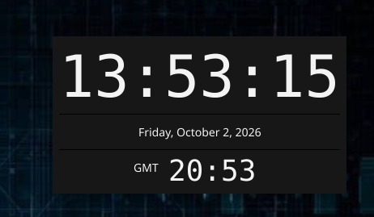

# simpleclock

A simple cross-platform desktop clock built with Go and [Fyne](https://fyne.io/). Displays the current time and date, updating every second.



## Features

- Large, readable 24-hour time display
- Full date shown below the time
- Optional secondary clocks for additional timezones
- Day offset indicator when a secondary clock is on a different calendar day
- Respects system light/dark theme
- Borderless mode with draggable window
- Optional always-on-top mode
- Cross-platform: Linux, Windows, macOS

## Download

Prebuilt binaries for Linux and Windows (amd64) are available on the [Releases page](https://github.com/devinthemtn/simpleClockGo/releases/latest).

- **Linux:** download `simpleclock-<version>-linux-amd64.tar.gz`, extract it, and run `./simpleclock`. The OpenGL/X11 runtime libraries must be installed (present on most desktop distributions).
- **Windows:** download `simpleclock-<version>-windows-amd64.zip`, extract it, and run `simpleclock.exe`.

Verify downloads against `SHA256SUMS` with `sha256sum -c SHA256SUMS --ignore-missing`.

macOS users should build from source (see below).

## Requirements

Building requires a C compiler (cgo) because Fyne uses OpenGL.

### Go

Go 1.22 or later.

### Linux

```bash
sudo apt-get install -y gcc pkg-config libgl1-mesa-dev libx11-dev libxcursor-dev \
  libxrandr-dev libxinerama-dev libxi-dev libxxf86vm-dev
```

### Windows (cross-compiling from Linux)

```bash
sudo apt-get install -y gcc-mingw-w64-x86-64
```

### macOS (cross-compiling from Linux)

Requires [osxcross](https://github.com/tpoechtrager/osxcross) with `o64-clang` on your `PATH`. Building natively on a Mac requires no extra tools beyond Go.

## Building

```bash
git clone https://github.com/devinthemtn/simpleClockGo.git
cd simpleClockGo

# Linux
make

# Windows
make windows

# macOS (amd64)
make mac

# Clean build artifacts
make clean
```

Binaries are output to the `bin/` directory.

### Installing on Linux

```bash
make install    # installs to ~/.local (override with PREFIX=/usr/local)
make uninstall
```

This installs the binary, the icon and a `.desktop` entry, so the app shows up
in your launcher and the taskbar/dock shows the name "Simple Clock" and its icon
instead of a generic one.

## Running

```bash
# After building
./bin/simpleclock

# Or directly with Go
go run .
```

## Options

| Flag | Description |
|------|-------------|
| `--no-titlebar` | Launch without a window title bar. The window can still be dragged by clicking and dragging anywhere on it. |
| `--always-on-top` | Keep the clock window above other windows. Can also be enabled with `always_on_top: true` in the config file. |

```bash
./bin/simpleclock --no-titlebar --always-on-top
```

## Configuration

Secondary clocks and other settings are configured via a YAML file. The file is optional — the app runs fine without it.

**Config file location:**

| Platform | Path |
|----------|------|
| Linux | `$XDG_CONFIG_HOME/simpleclock/config.yaml` (defaults to `~/.config/simpleclock/config.yaml`) |
| macOS | `~/Library/Application Support/simpleclock/config.yaml` |
| Windows | `%APPDATA%\simpleclock\config.yaml` (e.g. `C:\Users\<user>\AppData\Roaming\simpleclock\config.yaml`) |

Create the `simpleclock` directory if it does not exist, then add a `config.yaml`:

```yaml
always_on_top: true

clocks:
  - timezone: "America/New_York"
    label: "New York"
  - timezone: "Europe/London"
    label: "London"
  - timezone: "Asia/Tokyo"
    label: "Tokyo"
```

- `always_on_top` — keep the window above other windows (same as `--always-on-top`). Defaults to `false`.
- `timezone` — IANA timezone name (e.g. `America/Chicago`, `UTC`). Required.
- `label` — display name shown next to the clock. Defaults to the timezone name if omitted.

Entries with a missing or unrecognized timezone are silently skipped. Changes to the config file take effect on the next app launch.

## Troubleshooting

**`Fyne error: Error parsing user locale C`** — harmless; printed when the system locale is unset or set to `C`. Set a locale such as `LANG=en_US.UTF-8` to silence it.

## Dependencies

- [fyne.io/fyne/v2](https://github.com/fyne-io/fyne) v2.7.3
- [github.com/go-gl/glfw](https://github.com/go-gl/glfw) v3.3
- [gopkg.in/yaml.v3](https://github.com/go-yaml/yaml) v3.0.1

## License

Released under the [MIT License](LICENSE).

## Author

**Thomas Koefod** — [devinthemtn@gmail.com](mailto:devinthemtn@gmail.com)
